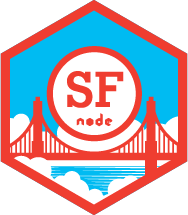

    

SFNode Contribute
=================
We meet on the second Thursday of every month. Join us!

[Propose a topic, talk, speaker, or location for SFNode.](https://github.com/sfnode/sfnode/issues)

### For talk proposals open an [issue](https://github.com/sfnode/sfnode/issues) that includes:

___

* Full name and Bio
* Talk title and abstract (description)
* Make sure talk is true to the title and abstract
* Twitter handle (optional)
* Other social profiles or personal blog (optional)
* Url to slides or github (either now or can be posted in meetup comments later)
* Are you going to be live coding?
* Do you need audio from your computer?
* See [past](https://github.com/sfnode/sfnode/issues/4) [proposals](https://github.com/sfnode/sfnode/issues/3) [for](https://github.com/sfnode/sfnode/issues/2) [examples](https://github.com/sfnode/sfnode/issues/1)

### For hosting opportunities open an [issue](https://github.com/sfnode/sfnode/issues) or [email us](mailto:teamsfnode@gmail.com) with answers to the following questions:

___

* What is the address, floor, room name if any, entrance instructions?
* Do we need to submit an attendee list for security purposes?
* What's the total number of people that space can hold?
* Will food and drinks will be provided? Are there vegetarian and gluten free options?
* What is the AV setup like?
* What is the microphone setup? Mic stand or headset mic?
* What is the parking situation like? Is bike parking available? Any off-street parking?
